The auto normal maps generation reference from ([Github link](https://github.com/azagaya/godot_normalMap_generator))

## Usage

Theme toggle
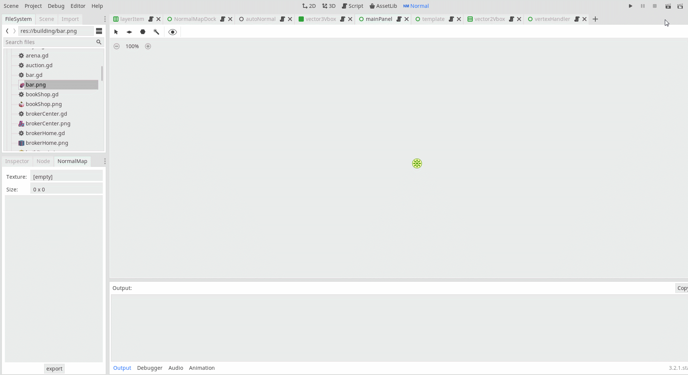

Load image
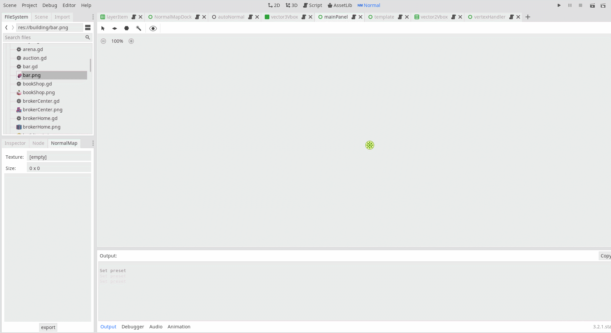

Create rect tool(hot key W)
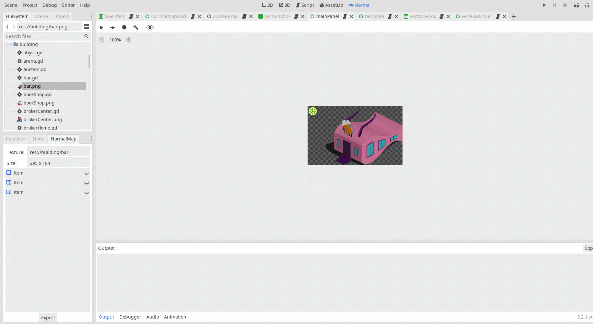

Watch normal(Normal hot key Z, light hot key L)
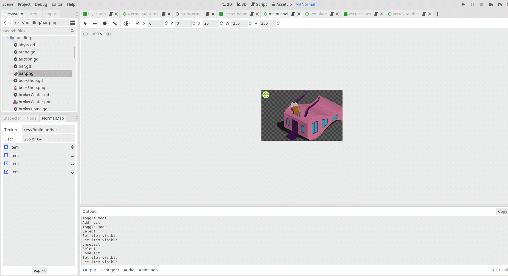

View scale and move(Mouse wheel/Ctrl+Add/Ctrl+Subtract to Zoom in/out, drag mouse middle button to move view, Home Key to reset view move, Ctrl+0 to reset view scale)
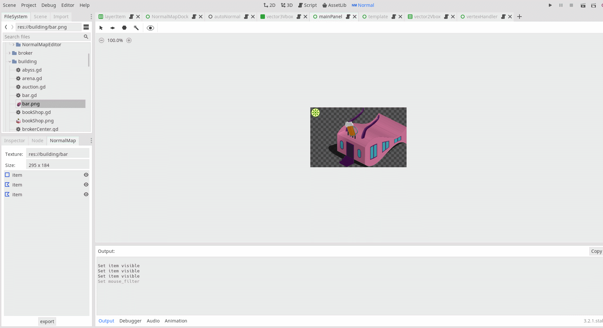

Create polygon tool(hot key E)
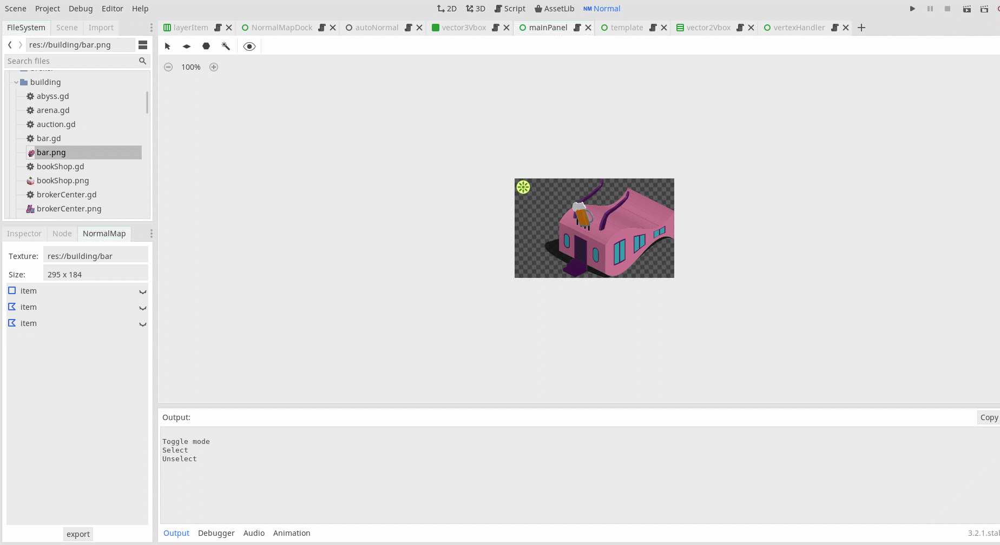

Magic tool(hot key R)
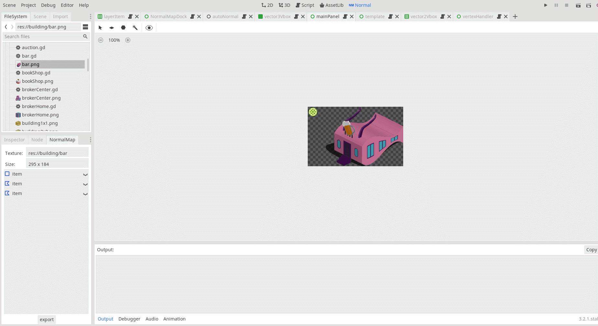

The NormalMap dock
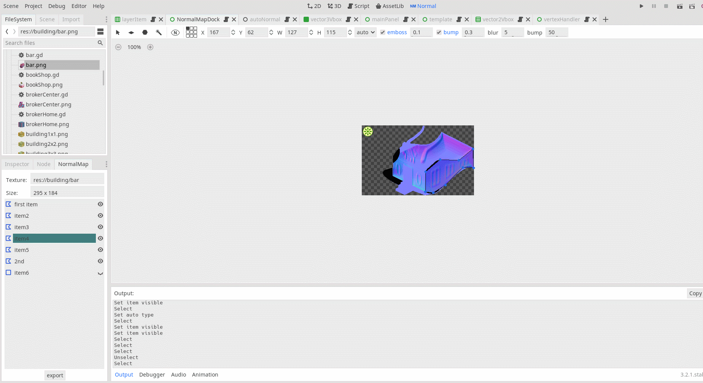

Select tool(hot Q)
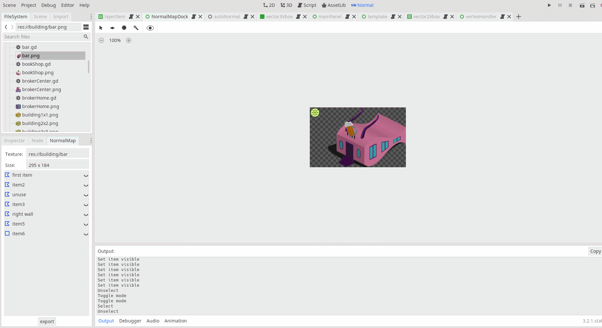

Undo redo(Ctrl+Z to undo, Ctrl+Shift+Z to redo)
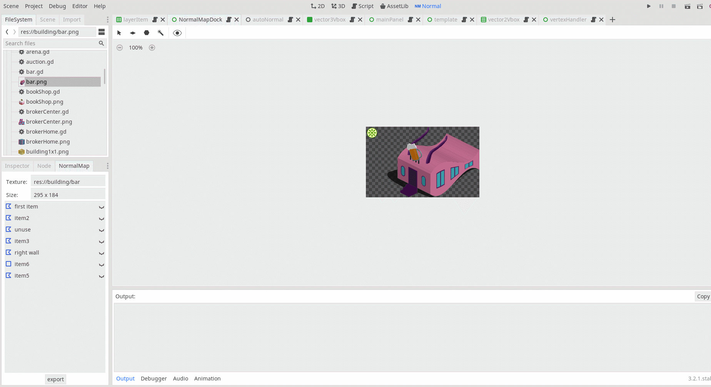

Save project(Ctrl+S)
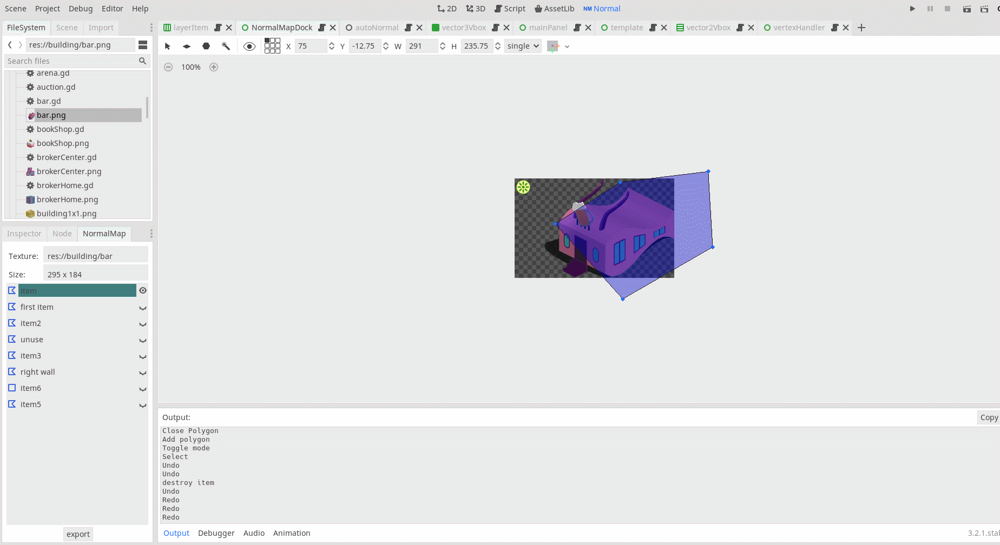

Export
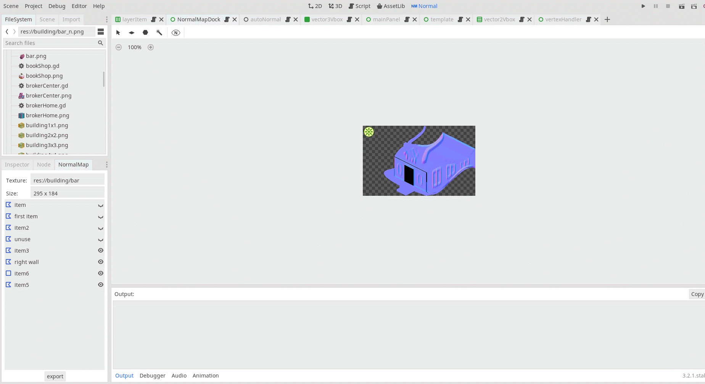
